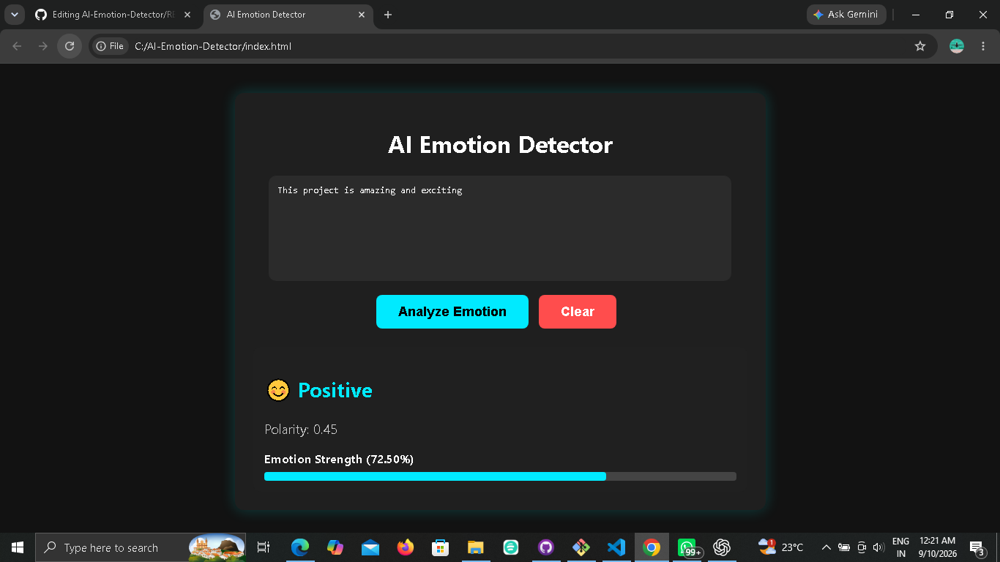
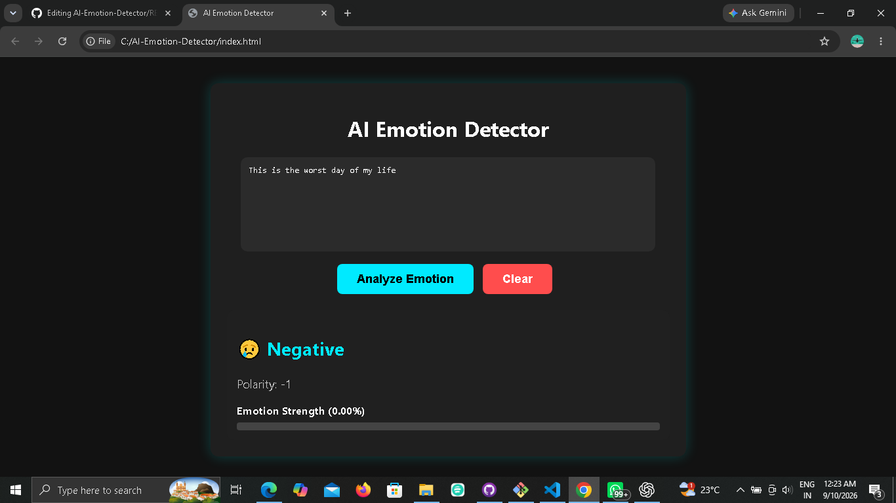
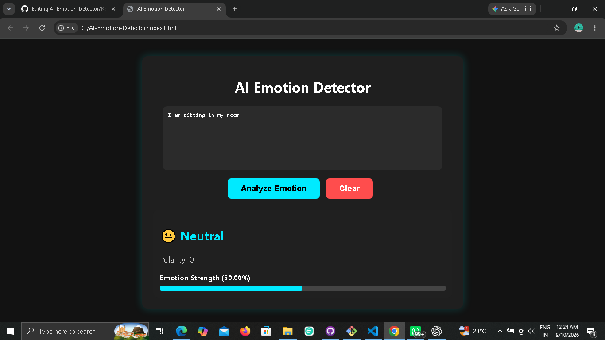
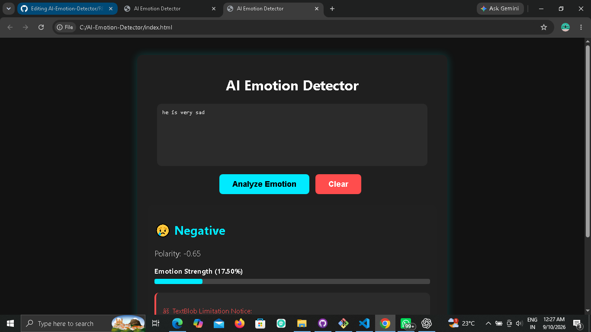
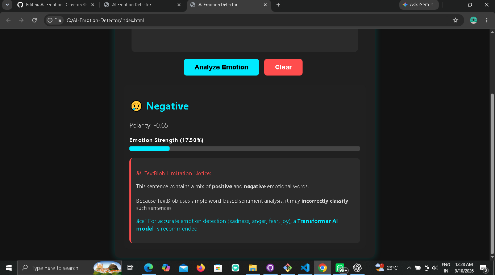

# AI Emotion Detector

AI Emotion Detector is a web-based application that analyzes user-provided text and classifies its **sentiment as Positive, Negative, or Neutral**.

The application uses **TextBlob** for basic Natural Language Processing (NLP), **Flask** for the backend REST API, and **HTML, CSS, and JavaScript** for the frontend.

---

## Features

- Analyze sentiment from user-provided text
- Classify text as:
  - 😊 Positive
  - 😢 Negative
  - 😐 Neutral
- Display sentiment polarity score
- Display polarity-based sentiment score percentage
- Interactive and user-friendly interface
- Clear/Reset functionality
- Flask REST API
- JSON request and response
- CORS support for frontend-backend communication
- TextBlob-based sentiment analysis
- Limitation notice for certain complex or mixed sentences

---

## Technologies Used

### Frontend
- HTML5
- CSS3
- JavaScript

### Backend
- Python
- Flask
- Flask-CORS

### Natural Language Processing
- TextBlob

### API
- REST API
- JSON
- Fetch API

### Tools
- Git
- GitHub

---

## Project Structure

```text
AI-Emotion-Detector/
│
├── app.py
├── index.html
├── script.js
├── style.css
├── README.md
├── .gitignore
├── .gitattributes
│
└── screenshots/
    ├── posiitive.png
    ├── negative.png
    ├── neural.png
    ├── mix.png
    └── mix2.png
```


---

## How the Project Works

The application follows a simple frontend-backend architecture:

```text
User enters text
       ↓
HTML/CSS/JavaScript Frontend
       ↓
JavaScript Fetch API
       ↓
POST /analyze
       ↓
Flask Backend
       ↓
TextBlob Sentiment Analysis
       ↓
Polarity Score
       ↓
Positive / Negative / Neutral
       ↓
JSON Response
       ↓
Result displayed on webpage
```

---

## Screenshots

### Positive Sentiment Detection



### Negative Sentiment Detection



### Neutral Sentiment Detection



### Mixed Sentiment Example





---

## Sentiment Classification

TextBlob calculates a **polarity score between -1 and +1**.

The application uses the following conditions:

```text
Polarity > 0.1
→ Positive 😊

Polarity < -0.1
→ Negative 😢

Polarity between -0.1 and 0.1
→ Neutral 😐
```

### Example 1: Positive

**Input:**

```text
I am very happy today!
```

**Output:**

```text
😊 Positive
```

### Example 2: Negative

**Input:**

```text
I am feeling very sad.
```

**Output:**

```text
😢 Negative
```

---

# REST API

The backend provides a REST API endpoint for sentiment analysis.

## Endpoint

```text
POST /analyze
```

When running locally:

```text
http://127.0.0.1:5000/analyze
```

### HTTP Method

```text
POST
```

### Content-Type

```text
application/json
```

---

## JSON Request

The frontend sends the user's text to the Flask backend in JSON format.

### Example Request

```json
{
    "text": "I am very happy today!"
}
```

The JavaScript frontend sends the request using the Fetch API:

```javascript
fetch("http://127.0.0.1:5000/analyze", {
    method: "POST",
    headers: {
        "Content-Type": "application/json"
    },
    body: JSON.stringify({
        text: text
    })
});
```

---

## JSON Response

The Flask backend processes the text using TextBlob and returns the analysis result as JSON.

### Example Response

```json
{
    "input": "I am very happy today!",
    "emotion": "Positive",
    "emoji": "😊",
    "polarity": 0.8
}
```

### Response Fields

| Field | Description |
|---|---|
| `input` | Original text entered by the user |
| `emotion` | Positive, Negative, or Neutral |
| `emoji` | Emoji representing the detected sentiment |
| `polarity` | TextBlob polarity score between -1 and +1 |

---

# Installation

## Prerequisites

Make sure you have the following installed:

- Python 3.x
- Git
- A web browser

---

## 1. Clone the Repository

```bash
git clone https://github.com/rajnandiniipatil/AI-Emotion-Detector.git
```

Navigate to the project directory:

```bash
cd AI-Emotion-Detector
```

---

## 2. Install Required Libraries

Install Flask:

```bash
pip install flask
```

Install TextBlob:

```bash
pip install textblob
```

Install Flask-CORS:

```bash
pip install flask-cors
```

Or install all dependencies together:

```bash
pip install flask textblob flask-cors
```

---

# How to Run

## Step 1: Start the Flask Backend

Open Git Bash or Command Prompt inside the project folder.

Run:

```bash
python app.py
```

You should see:

```text
* Serving Flask app 'app'
* Debug mode: off
* Running on http://127.0.0.1:5000
```

Keep this terminal running.

---

## Step 2: Open the Frontend

Open the following file:

```text
index.html
```

You can double-click `index.html` to open it in your web browser.

---

## Step 3: Analyze Text

Enter a sentence in the text box.

For example:

```text
I am feeling very happy today!
```

Click:

```text
Analyze Emotion
```

The frontend sends the text to the Flask backend.

The backend analyzes the text using TextBlob and returns the result as JSON.

The result is then displayed on the webpage.

---

# TextBlob Limitation

This project currently uses **TextBlob**, which provides basic sentiment analysis using a polarity score.

It classifies text into:

- Positive
- Negative
- Neutral

However, TextBlob does **not perform advanced emotion recognition** for specific emotions such as:

- Joy
- Sadness
- Anger
- Fear
- Surprise
- Disgust

Complex or mixed sentences may sometimes be classified incorrectly because TextBlob performs basic sentiment analysis rather than deep contextual emotion understanding.

The application includes a limitation notice for certain sentences to demonstrate this limitation.

For more accurate emotion detection, a trained Machine Learning or Transformer-based NLP model could be integrated.

---

# Future Improvements

The project can be improved by adding:

- Transformer-based emotion classification
- Detection of specific emotions such as joy, anger, sadness, fear, and surprise
- Better handling of mixed and complex sentences
- User authentication
- Database integration
- Emotion analysis history
- Analytics dashboard
- Data visualization and charts
- Better API error handling
- Automated testing
- Cloud deployment
- Production-ready backend

---

# Learning Outcomes

Through this project, I learned and practiced:

- Python
- Flask
- REST API development
- HTTP POST requests
- JSON data exchange
- JavaScript Fetch API
- Frontend-backend integration
- CORS
- Natural Language Processing basics
- Sentiment analysis using TextBlob
- Git
- GitHub

---

# Author

**Rajnandini Patil**

B.Tech Computer Science and Engineering Student

---

## License

This project is created for educational and learning purposes.
